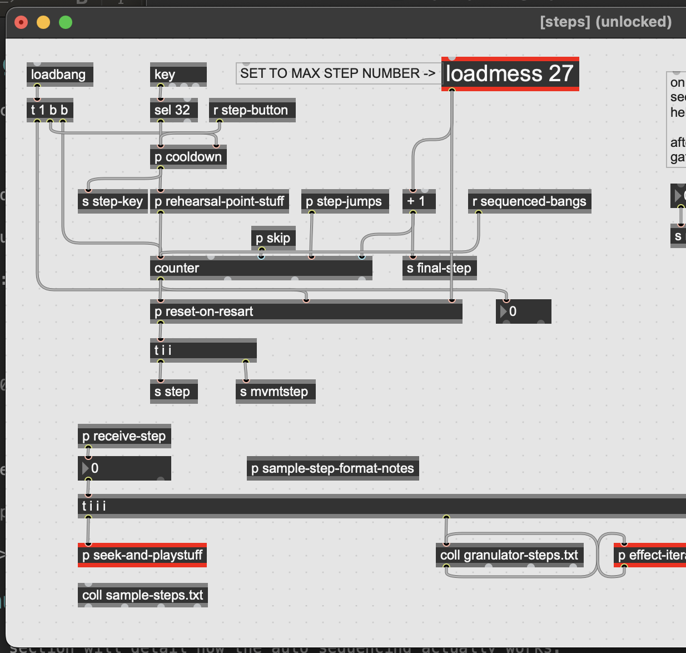
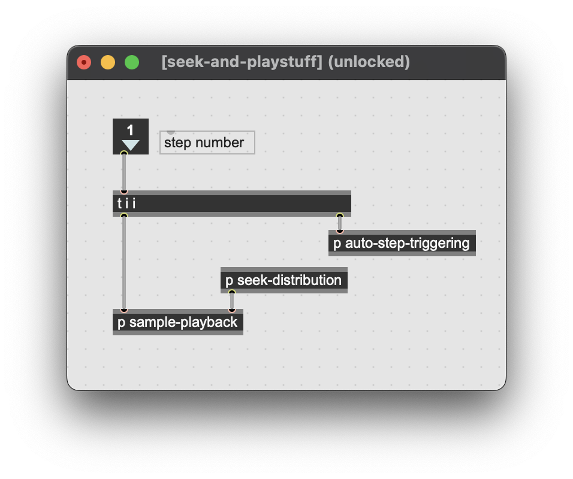
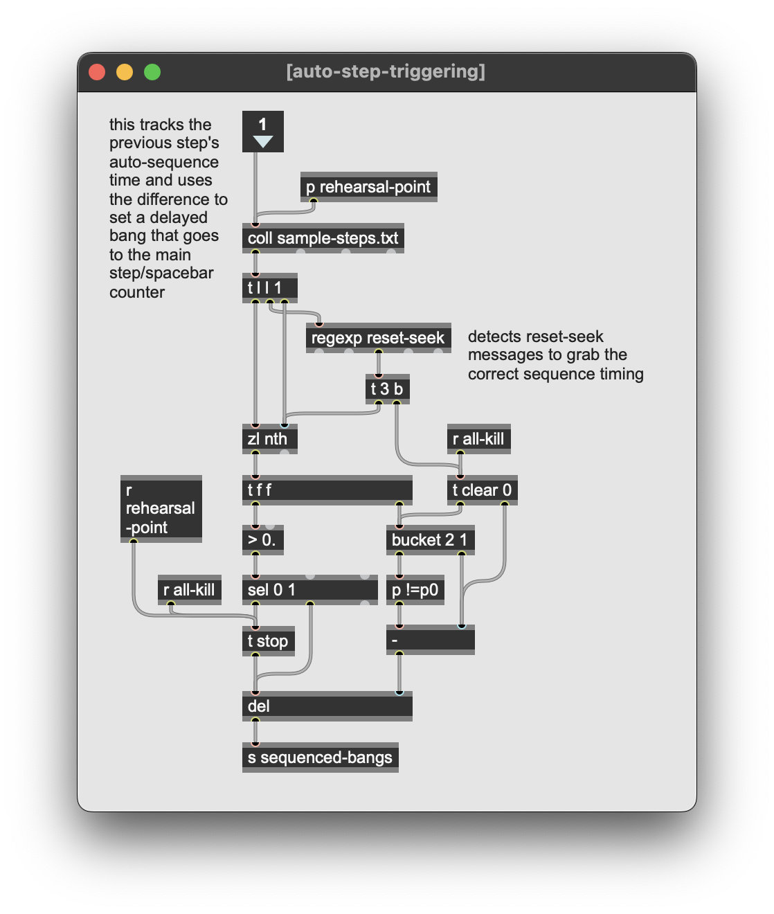
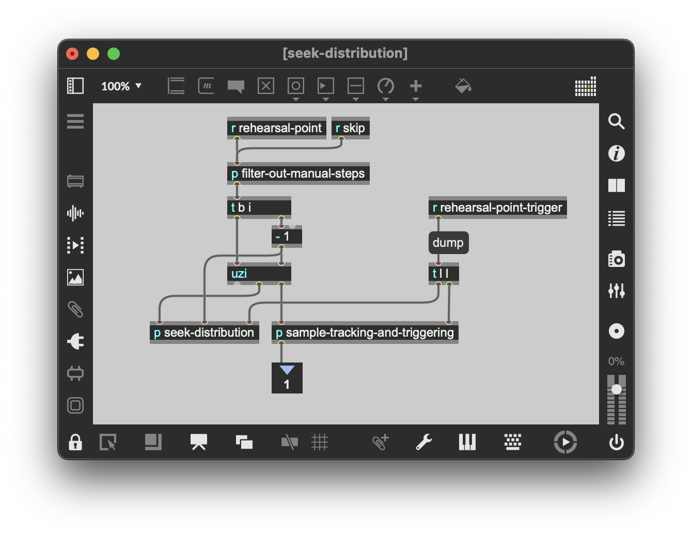
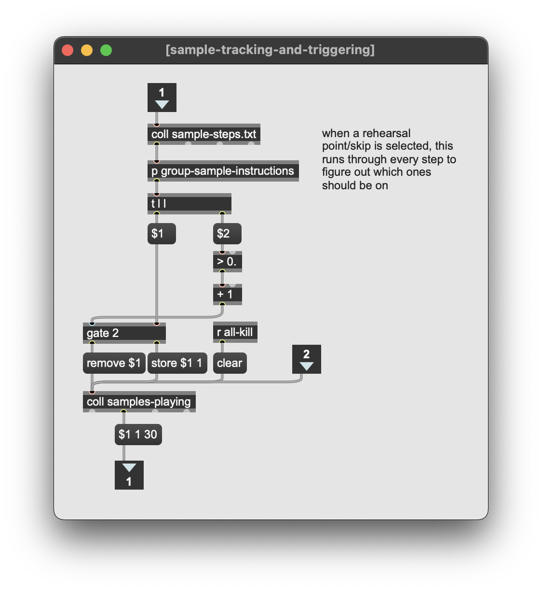
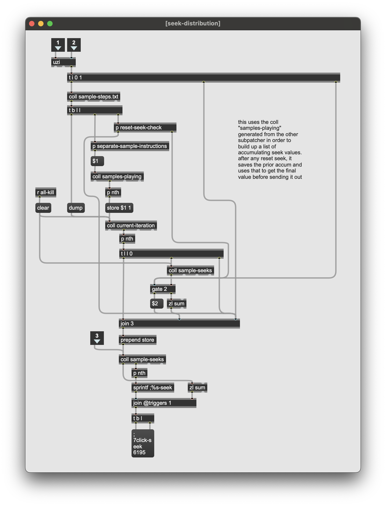
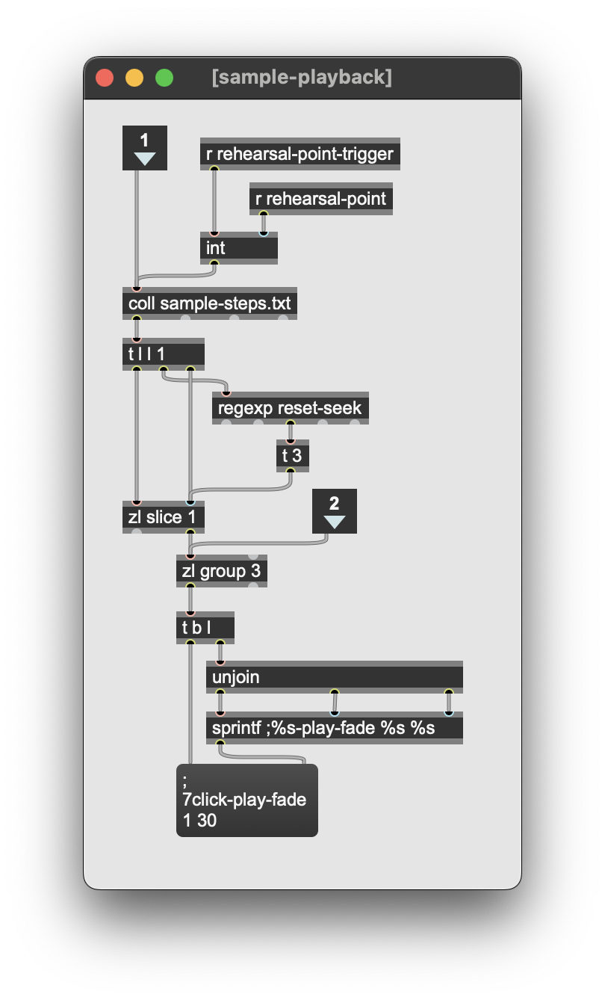

## general usage notes

the current step.txt format is:

`[ms for auto, 0 for manual] [filename without extension] [0-1 start/stop] [fadetime in ms]`

"auto" means a step that will auto play the next one after a set time.

"manual" means it will require cue/step input to progress.

NOTE: the auto time must always be put in the preceding step

e.g. if step 3 is to be played 2000ms after step 2, your steps would look like this:

> 1, 0 1 1 0; 
> 2, 2000 2 1 0; 
> 3, 0 3 1 0; 

any effects will need their own format as needed, but generally they go:

`[input channel] [0-1 enable/disable] [any additional control steps]`

note, in some cases you may need the auto-sequencing timer to trigger relative to a new sample, e.g. sample 3 may be the new starting point. for this you must use a **reset-seek** message, which looks like this:

> 1, 0 1 1 0;  
> 2, 2000 2 1 0; // triggers step 3 after 2000ms  
> 3, 2000 reset-seek 1000 3 1 0; 	// step 3 is the new start time, triggers step 4 after 1000ms  
> 4, 2500 4 1 0; // proceeds as normal  

note that step 3 has the same first argument (2000). this allows auto sequenced steps prior to the **reset-seek** to still get the correct seek time.

  

##auto-sequencing process

this section will detail how the auto sequencing actually works. 

in the "steps" subpatcher where all the text files are triggered, you'll see something like what's below. mostly the top section has to do with sending/receiving the cue triggers. the only main thing to look out for here is that the main step counter needs to be hooked up to a **receive sequenced-bangs**. otherwise, everything is going to happen in the red highlighted **seek-and-playstuff** subpatcher.

inside **seek-and-playstuff** is pretty simple. we'll take a look at each of these subpatchers separately as they all represent very separate components/processes.

###auto-step-triggering

this handles the autotomatic triggering of sequenced steps during normal playback. in other words, this is for when the piece has been set in motion via a cue trigger and is now proceeding as usual for performance.

###seek-distribution

this is only used in the event that a rehearsal-point is selected, or in other words that a cue or movement has been selected to be skipped to. samples that should have already been playing at that point in the piece are sent seek values so that they are synced up with the score.

once a step number has been chosen, we must iterate through every step in **sample-steps.txt** from the beginning to determine which samples should be playing. we do this by tracking which samples have been sent an "on" message and store it. if we see that it later gets an "off" message, we remove it from the list of **samples-playing**. also note, that the second inlet is used to send out all the stored samples once the **rehearsal-point-trigger** is received.

 
once that list of **samples-playing** has been collected, we use it to then iterate through the **sample-steps.txt** again and store each sample with its relative auto-sequence value. note that in the event of a **reset-seek**, we need to store the previous seek value and then add it to any seek values that occur after that **reset-seek** step. this ensures that any samples whose playback overlap with that step will still have the correct accumulated seek value sent out.
 

 
 
###sample-playback
 
this part is pretty straightforward, just formatting and sending out the actual play messages to their respective samples.
 
 