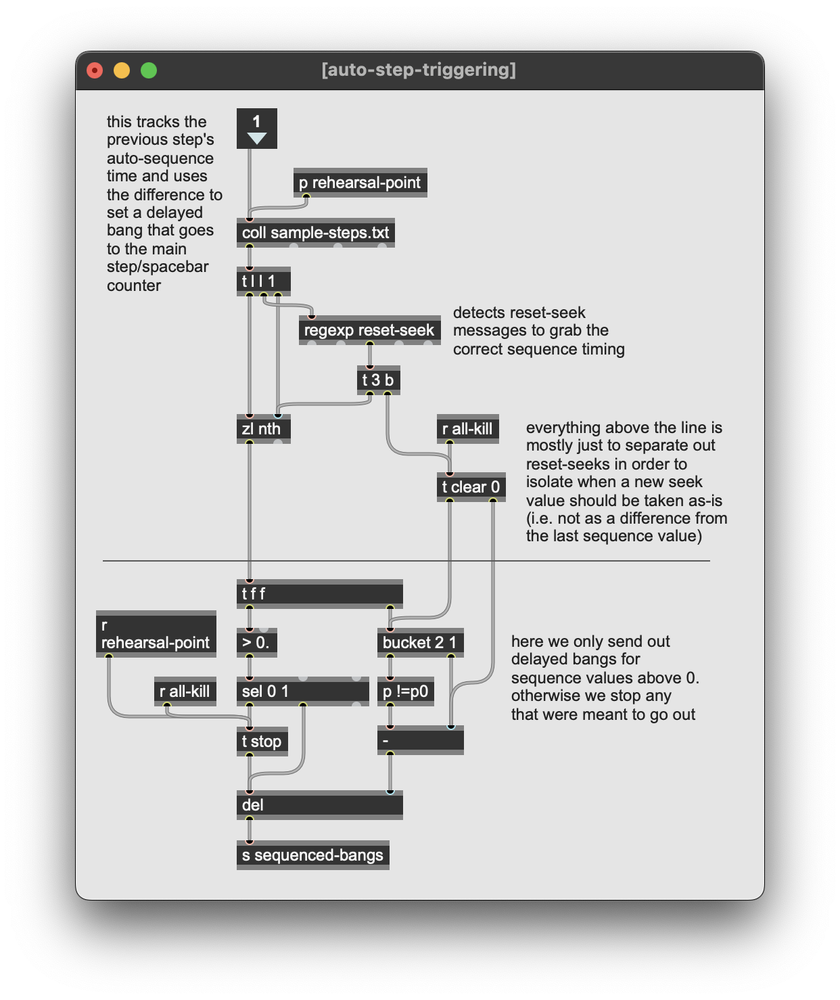

## general usage notes

the current sample-steps.txt format is:

`[filename without extension] [0-1 start/stop] [fadetime in ms]`

```
1, 1 1 10; // fade in file 1 over 10ms
2, 2 1 10; // fade in file 2 over 10ms
3, 3 1 10 1 0 1000; // fade in file 3 over 10ms, fade out file 1 over 1000
```

the current step-sequencer-info.txt format is:

`[milliseconds from last manual step after which step auto-plays] [optional reset timer flag]` 

```
3, 2000;
```

This above files combined would be interpreted as:

| Queue              | Description | How To Advance |
| :---------------- | :------ | :------ |
| 0 |  You open the patch, no audio is playing, cue "0" is displayed  | press space bar or button to advance
| 1 |   First audio file, ( "1", in the file system as 1.wav, 1.m4a, etc.) begins to play with no fade in   | patch waits for space bar or button click to advance from 1 to 2
| 2 |  1.wav is some variable amount into playback, and file "2" starts playing from the start   | after 2 seconds, patch automatically advances from 2 to 3
| 3 |  2.wav continues playing (2 is 2000ms elapsed), and 3.wav is added to the mix. 1.wav is faded out over 1000ms | when the audio files play out, the piece ends, and there is no next queue.


any effects will need their own format as needed, but generally they go:

`[input channel] [0-1 enable/disable] [any additional control steps]`

note, in some cases you may need the auto-sequencing timer to trigger relative to a new sample, e.g. sample 3 may be the new starting point. for this you must use a **reset** message, which looks like this:

```
sample-steps.txt
1, 1 1 0;
2, 2 1 0;
3, 3 1 0;
4, 1 0 10 2 0 10;
5, 3 0 10;
```
```
step-sequencer-info.txt
2, 3000;
3, 8000 reset;
4, 2000;
5, 7000;
```
This would be read by the patch as:

| Queue              | elapsed ms at start of cue | Description | How To Advance |
| :---------------- | :------ | :------ | :------ |
| 0 | 0 |  You open the patch, no audio is playing, cue "0" is displayed  | press space bar or button to advance
| 1 | 0 |   First audio file, ( "1", in the file system as 1.wav) begins to play with no fade in   | after 3 seconds, patch automatically advances from 1 to 2
| 2 | 3000 |  1.wav is 3000ms into playback, and file "2" starts playing   | after 5 seconds (8000-3000), patch automatically advances from 2 to 3
| 3 | 8000 | 1.wav is at 8000ms<br/>2.wav is at 5000ms<br/>3.wav starts playing | after 2 seconds (2000, after reset), patch automatically advances from 3 to 4
4 | 10000 | 1.wav and 2.wav both stop playing with a 10ms fade out (10ms to prevent clipping)<br/>3.wav is at 2000ms | after 5 seconds (7000-2000), patch automatically advances from 4 to 5
5 | 15000 | 3.wav is at 7000ms and stops with 10ms fade out | no next cue


<br/><br/>


## auto-sequencing process

this section will detail how the auto sequencing actually works. 

in the "steps" subpatcher where all the text files are triggered, you'll see something like what's below. mostly the top section has to do with sending/receiving the cue triggers. the only main thing to look out for here is that the main step counter needs to be hooked up to a **receive sequenced-bangs**. otherwise, everything is going to happen in the red highlighted **seek-and-playstuff** subpatcher.


inside **seek-and-playstuff** is pretty simple. we'll take a look at each of these subpatchers separately as they all represent very separate components/processes.


### auto-step-triggering

this handles the autotomatic triggering of sequenced steps during normal playback. in other words, this is for when the piece has been set in motion via a cue trigger and is now proceeding as usual for performance.



### seek-distribution

this is only used in the event that a rehearsal-point is selected, or in other words that a cue or movement has been selected to be skipped to. samples that should have already been playing at that point in the piece are sent seek values so that they are synced up with the score.


once a step number has been chosen, we must iterate through every step in **sample-steps.txt** from the beginning to determine which samples should be playing. we do this by tracking which samples have been sent an "on" message and store it. if we see that it later gets an "off" message, we remove it from the list of **samples-playing**. also note that the second inlet receives a dump message to send out all the stored samples once the **rehearsal-point-trigger** is received.


 
once that list of **samples-playing** has been collected, we use it to then iterate through the **sample-steps.txt** again and store each sample with its relative auto-sequence value. note that in the event of a **reset**, we need to store the previous seek value and then add it to any seek values that occur after that **reset** step. this ensures that any samples whose playback overlap with that step will still have the correct accumulated seek value sent out.
 

 
 
### sample-playback
 
this part is pretty straightforward, just formatting and sending out the actual play messages to their respective samples.
 
 
